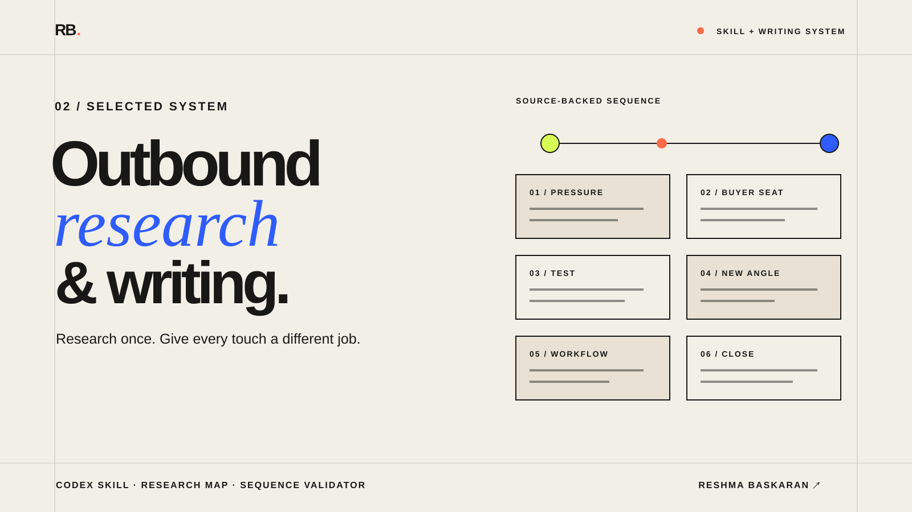

# Outbound Research & Writing



A source-backed, draft-only starter kit for researching accounts, deciding what
is safe to say, and writing six-touch outbound sequences that do not repeat
themselves.

It packages a real operating method for local use. It is not a campaign sender,
enrichment product, or library of invented outreach examples.

## The operating path

| State | What the system does |
|---|---|
| `needs_input` | Lists only the missing campaign fields and creates no sequence |
| `ready_for_research` | Confirms the brief is complete |
| `needs_research` | Creates an account research map, never recipient copy |
| `ready_for_review` | Validates six distinct touches, claim lineage, greeting, CTA and sender-derived signoff |

```text
campaign brief → research map → sourced claims → six touch roles → human review
```

The workflow is intentionally draft-only. A passing validator means the copy is
structurally reviewable; it does not verify a recipient, approve a claim or
authorize sending.

If this research-to-writing method is useful, **star the repository** to keep it
close and help another outbound operator discover it.

## The problem

Personalization often fails in one of two ways: it is generic enough to fit every account, or it turns a weak public clue into an unsupported claim. Longer sequences compound the problem by repeating the same observation six times.

This repository captures the method I use to move from account research to review-ready copy while keeping facts, hypotheses, and unknowns separate.

## What is included

- A [quickstart](QUICKSTART.md), local configuration example, and workspace initializer.
- A reusable agent skill in [`skill/outbound-research-and-writing`](skill/outbound-research-and-writing).
- An account-use-case research schema.
- A six-touch message architecture.
- A fail-closed campaign-input and readiness check.
- A resumable case command that creates no sequence before input and research
  gates pass and preserves completed research on rerun.
- Explicit research and launch boundaries.
- A deterministic validator for structure, required inputs, claim lineage,
  placeholders, duplication, touch roles, CTA, signoff, and review readiness.
- Blank research-map, sequence, and review-checklist templates.
- Field notes from dormant-lead, time-sensitive, and account-personalized campaign work.
- A [real, anonymised event-led insurance outreach walkthrough](docs/cases/event-led-insurance-outreach.md)
  showing how one campaign thesis changed across seven senior-buyer roles.

## What a fork gives you

After setup, a fork gives you a local workspace for research maps, draft
sequences, reviews, and outputs. Add your own permitted account inputs and
source URLs, use the skill to draft, and validate the sequence before human
review.

It does not include recipient records, private campaign copy, sending-platform
exports, enrichment credentials, or launch state. A successful validation is a
structural gate, not permission to send.

## How it works

```text
account list
  → research map
  → keep / rewrite / suppress / needs research
  → confirmed fact / hypothesis / unknown
  → operating problem and consequence
  → six distinct touch roles
  → structural and editorial QA
  → human approval
```

## Use the skill

See [QUICKSTART.md](QUICKSTART.md) for the full setup and workspace initializer.

Copy the skill folder into your agent's supported skills directory, or point
your coding agent at the local [`SKILL.md`](skill/outbound-research-and-writing/SKILL.md)
and ask:

```text
Use the outbound-research-and-writing skill in this repository to research these accounts and draft a grounded outbound sequence.
```

Check whether the campaign has enough input to begin research:

```bash
python skill/outbound-research-and-writing/scripts/check_readiness.py \
  /path/to/campaign-input.json
```

Validate a sequence only after the input and research gates pass:

```bash
python skill/outbound-research-and-writing/scripts/validate_sequence.py path/to/sequence.json
```

The JSON document must embed the campaign inputs, reference an existing
research map, include structured source-backed claims, and contain exactly six
distinct touch roles. Only the first email may have a subject. Passing means
ready for human review; it never means verified recipient, permission to send,
or launch approval.

Every review draft starts with `Hi [first name],`. The signoff is taken from
the campaign's `sender_identity`, so a fork never defaults to the repository
author's name.

## Real campaign walkthrough

The [event-led insurance outreach case](docs/cases/event-led-insurance-outreach.md)
is derived from a real seven-draft campaign packet. It preserves the research,
problem-framing, buyer-angle, claim-lineage, and CTA decisions while removing
all people, companies, URLs, product identity, and private copy. The source
does not contain verified send or performance data, so the case makes no reply,
meeting, pipeline, or revenue claim.

## What this repository does not contain

It does not publish private recipient data, sending-platform exports, confidential campaign copy, or invented portfolio examples. The [field notes](docs/field-notes.md) explain what changed in the operating method across real campaign types without presenting private work as public evidence.

## Current status

The workflow is in active use as the writing and QA layer for account-personalized
outbound and is now packaged as a local starter kit. Uploading, lead
verification, enrichment spend, and campaign launch remain explicit human
decisions.

## Author

Built by **Reshma Baskaran**, a GTM and growth marketer building practical research, outbound, and knowledge systems.
